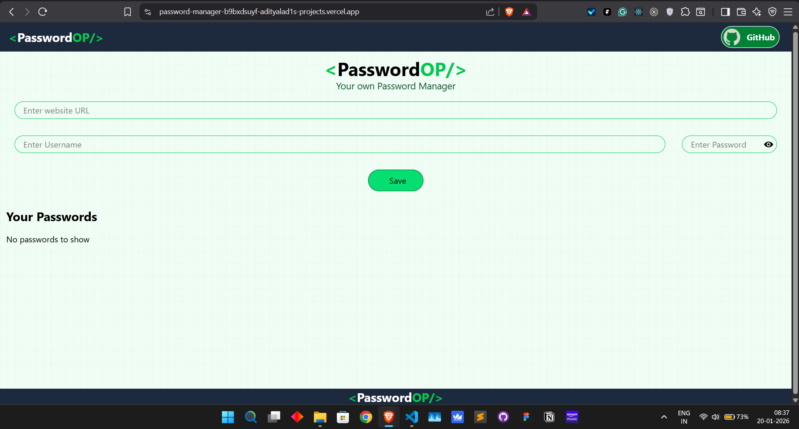
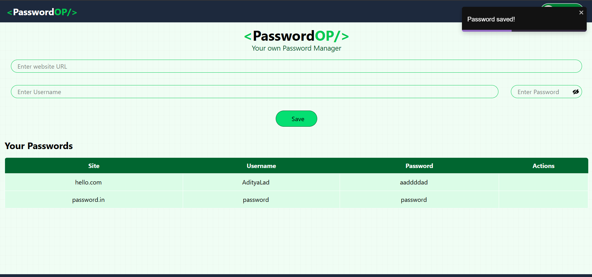

## Refactored Project

This Password Manager is a ground-up rewrite of a previous implementation that had scalability and maintainability limitations.

The new version focuses on:

- Clean architecture and modular design  
- Improved state handling and validation  
- Production-quality commit practices  
- Better performance and reliability  

This project reflects my current development standards and engineering maturity.

## Previous Version (Screenshots for Reference)

These screenshots are from the earlier implementation, preserved for historical comparison.

**Previous version:** Private repository (available upon request).
